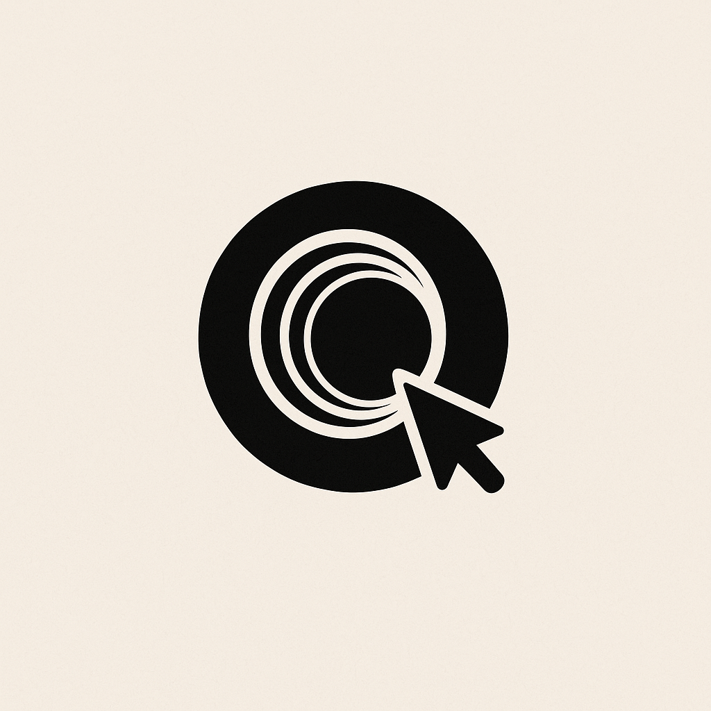

  <picture style="margin-bottom: 20px; display: block;">
    <source media="(prefers-color-scheme: dark)" alt="Portal logo" height="150" srcset="img/pointer.png">
    <source media="(prefers-color-scheme: light)" alt="Portal logo" height="150" srcset="img/pointer.png">
    
  </picture>
  <h1>Portal: GUI Tools for Agents</h1>

Portal is an open source project by [Agentbase](https://www.agentbase.sh) that provides a suite of GUI tools for agents to collaborate with humans. With Portal, AI agents can interact with browsers, operating systems, text editors, media players, IDEs, and many other interfaces, enabling seamless human-AI collaboration on complex tasks. Whether for development, content creation, or data analysis, Portal bridges the gap between AI capabilities and human workflows.

More coming soon...
